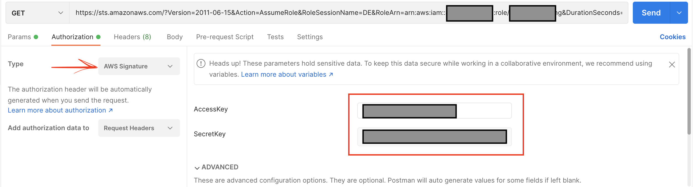
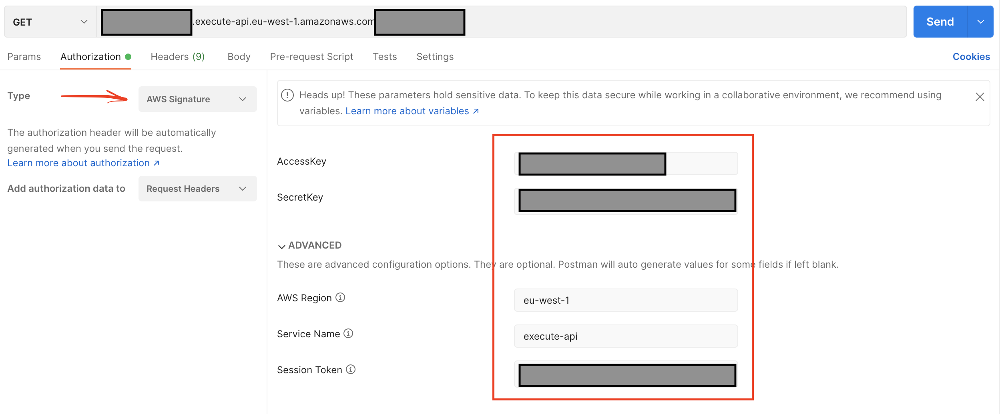

# How to call an API secured with IAM

APIs on the API Gateway service are generally secured with IAM. In other words, you must assume a role before calling an API. By assuming a role, it means you need to create a temporary credential by calling the AssumeRole API. To call AssumeRole from Postman (or curl, ...), you should follow the [AssumeRole API documentation](https://docs.aws.amazon.com/STS/latest/APIReference/API_AssumeRole.html). AWS credentials must also be used for authentication. Here is an example of what the process should look like:

### Assume the role

You call the AssumeRole API to assume DE role. What you need is a role session name and a role ARN.

```
GET https://sts.amazonaws.com/
?Version=2011-06-15
&Action=AssumeRole
&RoleSessionName=roleSessionName
&RoleArn=arn:aws:iam::123456781234:role/myrole
&DurationSeconds=3600
```

In this example, we want to assume the Delivery engine role. Take in mind that you need to [calculate signature](https://docs.aws.amazon.com/general/latest/gr/sigv4_signing.html) or use Postman that handles this calculation for you by providing your Access key and your secret key. You can create an access key and secret key on [IAM management Console]([IAM management Console](https://console.aws.amazon.com/iam/home?region=eu-west-1#/security_credentials))

```curl --location --request GET 'https://sts.amazonaws.com/?Version=2011-06-15&Action=AssumeRole&RoleSessionName=DE&RoleArn=arn:aws:iam::ARN:role/BE&DurationSeconds=3600' \
curl --location --request GET 'https://sts.amazonaws.com/?Version=2011-06-15&Action=AssumeRole&RoleSessionName=DE&RoleArn=arn:aws:iam::ARN:role/BE&DurationSeconds=3600' \
--header 'X-Amz-Date: 20210924T063427Z' \
--header 'Authorization: AWS4-HMAC-SHA256 Credential=ACCESS_KEY/20210924/us-east-1/sts/aws4_request, SignedHeaders=host;x-amz-date, Signature=440777b1984306862ac7eda23914d753d3f3c148645fbd5f71970d7ceceb392
```

A response looks like as following: 

```xml

<AssumeRoleResponse xmlns="https://sts.amazonaws.com/doc/2011-06-15/">
<AssumeRoleResult>
<AssumedRoleUser>
<AssumedRoleId>DE</AssumedRoleId>
<Arn>arn:aws:sts::ARN:assumed-role/BE/DE</Arn>
</AssumedRoleUser>
<Credentials>
<AccessKeyId>ACCESSKEY</AccessKeyId>
<SecretAccessKey>SECRET</SecretAccessKey>
<SessionToken>TOKEN</SessionToken>
<Expiration>2021-09-24T07:34:27Z</Expiration>
</Credentials>
</AssumeRoleResult>
<ResponseMetadata>
<RequestId>9729d34a-2cbe-4798-acf7-06c4a3aa5f90</RequestId>
</ResponseMetadata>
</AssumeRoleResponse>
```

Postman 




### Call the API 

Let's imagine you want to invoke [this URL](https://url.execute-api.eu-west-1.amazonaws.com/de/path) which is from the Uatu service. 

Every security credential you need is in the response to the AssumeRole request. Your request will look like this: 

```
curl --location --request GET ``'https://url.execute-api.eu-west-1.amazonaws.com/de/path'` `\``--header ``'X-Amz-Security-Token: TOKEN'` `\``--header ``'X-Amz-Date: 20210924T075100Z'` `\``--header ``'Authorization: AWS4-HMAC-SHA256 Credential=ACCESS_KEY/20210924/eu-west-1/execute-api/aws4_request, SignedHeaders=host;x-amz-date;x-amz-security-token, Signature=1539b6d4c6ecd45bb4f6eb6ba29880f52712b92fe389fe3e8d6182e0cb311fcc'
```

Postman 



You can also import the following Collection to your Postman, replace your own access key and secret key and start using it. 

```json
{
  "info": {
    "_postman_id": "8e6f7056-5703-4a15-86e2-3b82d4d4ab0c",
    "name": "Example",
    "schema": "https://schema.getpostman.com/json/collection/v2.1.0/collection.json"
  },
  "item": [
    {
      "name": "Assume DE role",
      "event": [
        {
          "listen": "test",
          "script": {
            "exec": [
              "var jsonResponseBody = xml2Json(responseBody);",
              "var credentials = jsonResponseBody['AssumeRoleResponse']['AssumeRoleResult']['Credentials']",
              "pm.collectionVariables.set(\"AccessKeyId\", credentials['AccessKeyId']);",
              "pm.collectionVariables.set(\"SecretAccessKey\", credentials['SecretAccessKey']);",
              "pm.collectionVariables.set(\"SessionToken\", credentials['SessionToken']);",
              ""
            ],
            "type": "text/javascript"
          }
        }
      ],
      "request": {
        "auth": {
          "type": "awsv4",
          "awsv4": [
            {
              "key": "accessKey",
              "value": "YOUR_ACCESS_KEY",
              "type": "string"
            },
            {
              "key": "service",
              "value": "sts",
              "type": "string"
            },
            {
              "key": "region",
              "value": "",
              "type": "string"
            },
            {
              "key": "secretKey",
              "value": "YOUR_SECRET_KEY",
              "type": "string"
            },
            {
              "key": "sessionToken",
              "value": "",
              "type": "string"
            }
          ]
        },
        "method": "GET",
        "header": [],
        "url": {
          "raw": "https://sts.amazonaws.com/?Version=2011-06-15&Action=AssumeRole&RoleSessionName=DE&RoleArn=arn:aws:iam::ARN:role/BE&DurationSeconds=3600",
          "protocol": "https",
          "host": ["sts", "amazonaws", "com"],
          "path": [""],
          "query": [
            {
              "key": "Version",
              "value": "2011-06-15"
            },
            {
              "key": "Action",
              "value": "AssumeRole"
            },
            {
              "key": "RoleSessionName",
              "value": "DE"
            },
            {
              "key": "RoleArn",
              "value": "arn:aws:iam::ARN:role/BE"
            },
            {
              "key": "DurationSeconds",
              "value": "3600"
            }
          ]
        }
      },
      "response": []
    },
    {
      "name": "Uatu Launched",
      "request": {
        "auth": {
          "type": "awsv4",
          "awsv4": [
            {
              "key": "sessionToken",
              "value": "{{SessionToken}}",
              "type": "string"
            },
            {
              "key": "secretKey",
              "value": "{{SecretAccessKey}}",
              "type": "string"
            },
            {
              "key": "accessKey",
              "value": "{{AccessKeyId}}",
              "type": "string"
            },
            {
              "key": "service",
              "value": "execute-api",
              "type": "string"
            },
            {
              "key": "region",
              "value": "eu-west-1",
              "type": "string"
            }
          ]
        },
        "method": "GET",
        "header": [],
        "url": {
          "raw": "https://url",
          "protocol": "https",
          "host": [
            "mx907vte4l",
            "execute-api",
            "eu-west-1",
            "amazonaws",
            "com"
          ],
          "path": ["deprod", "launched"]
        }
      },
      "response": []
    }
  ],
  "variable": [
    {
      "key": "AccessKeyId",
      "value": ""
    },
    {
      "key": "SecretAccessKey",
      "value": ""
    },
    {
      "key": "SessionToken",
      "value": ""
    }
  ]
}

```

